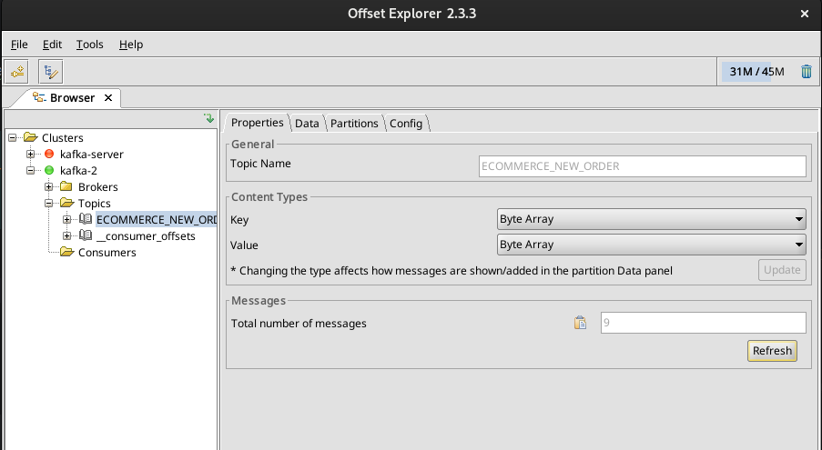

# eCommerce

Projeto de estudo Apache Kafka. Curso da Alura. [Kafka: Produtores, consumidores e streams](https://cursos.alura.com.br/course/kafka-introducao-a-streams-em-microservicos)

## Executando a aplicação.

O projeto conta com um `docker-compose` que sobe uma instância do **zookeeper** e do **kafka**.

Faça o comando `docker-compose up -d` para subir os containers

```shell
Creating network "ecommerce_default" with the default driver
Creating ecommerce_zookeeper_1 ... done
Creating ecommerce_kafka_1     ... done
```

Depois faça o comando `docker-compose ps` para checkar se os serviços subiram corretamente:

```shell
        Name                     Command            State                              Ports                            
------------------------------------------------------------------------------------------------------------------------
ecommerce_kafka_1       /etc/confluent/docker/run   Up      0.0.0.0:9092->9092/tcp,:::9092->9092/tcp                    
ecommerce_zookeeper_1   /etc/confluent/docker/run   Up      0.0.0.0:2181->2181/tcp,:::2181->2181/tcp, 2888/tcp, 3888/tcp
```

### Listando os tópicos

Você pode utilizar o seguinte programa [Kafkatool](https://kafkatool.com/download.html) para visualizar os tópicos criados junto ao kafka server.



